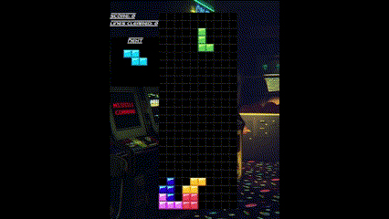

# Tetris Game

### Tetris game made with C++ and using SDL(Simple Directmedia Layer) as the graphics framework

## Controls:
Use arrow keys or WASD to move Tetromino
Press R to rotate tetromino

## Screenshots:

